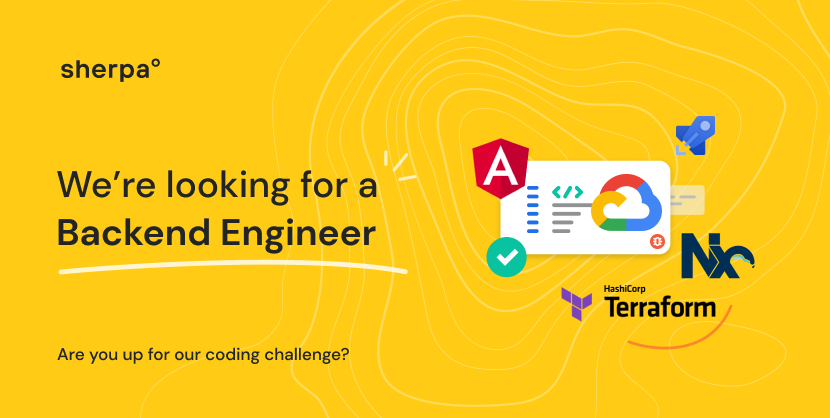

# Join sherpa° - the coding challenge
Find out more about sherpa° at our [careers page](https://joinsherpa.com/careers).

## Introduction

Hi! If you're reading this then it's because you're in the interview process with us at sherpa° and have been invited to
complete the coding challenge as a **Backend Engineer**. Congratulations! 🎉

This coding challenge is designed to assess your ability to write code while giving you the freedom to express yourself and show off
what you consider to be best practices.

## Setup

This repository contains the skeleton of a NodeJS Express app in TypeScript and an SQLite database, to which you will add functionality. The code here was built for node version 14.

The first step is to run `npm i` to install the required dependencies.

A handful of scripts are provided:

`npm run build` will build the application

`npm run start` will start the application 

`npm run test` will run the tests.

`npm run generateData` should be executed in order to populate a json file at `data/data.json` into the SQLite database. This is required
because it is necessary to set dates for events to be in the near future.

## The scenario

You are a building a new RESTful API to manage events which are currently organized by hand and this is proving unwieldly.
The first iteration of the solution is to add existing, upcoming events to a brand new database and build a REST API to get a list of events.

### Requirements

#### The Data

Determine how to model the data to be used in the API. You find a sample of what is currently available in `data/data.json`. 

The existing system is capturing events which have a location, a name, and an organizer, who is a member of staff
responsible for the event. You also know that there will be a need to associate a list of invitees with events, along
with their reservation status to confirm their attendance.

> Derive a data model for this relation of entities. Create the tables in the SQLite database, you may want to think
about maintainability and documentation, an Entity Relationship Diagram (ERD) might be useful, as might a migration process, you may want to think about using an Object-Relational Mapping framework.

The data given to you is a sample of the data as you expect to receive it. When the time comes they will
provide a very large json file to import into the db.

> Import the sample data into the database, write a script to do this and bear in mind it must operate at scale. You
should think about data integrity, chances are the large json file might not be complete for every event.

#### The API

`GET /events`

Retrieve upcoming events, the endpoint must accept the following query parameters:

- `from`: optional, Date, defaults ot the current time, only return events after this date
- `until`: optional, Date, if omitted return all future events

The required response is:

```
{
    results: [
        {
            id: <unique identifier of event in our system>,
            name: string,
            date: Date,
            isOutside: boolean
            attendees: [] // empty array is fine for first iteration
            organizer: {
                id: <unique identifier of organizer in our system>,
                name: string
            },
        }
    ]
}
```

In addition, the results must be paginated, the specifics of the pagination are left up to you to decide.

`GET /events/{eventId}`

Retrieve details for an upcoming event

```
{
    id: <unique identifier of event in our system>,
    name: string,
    date: Date,
    isOutside: boolean
    attandees: [] // empty array is fine for first iteration
    organizer: {
        id: <unique identifier of organizer in our system>,
        name: string
    },
    // if an event is outside and occuring withing 7 days, call any weather api to get the following details
    // if an event is not outside, or not occuring within 7 days this should be null
    weather: null || {
        temperatureInDegreesCelcius: number,
        chanceOfRain: number 0-100
    }
}
```

# Tips

You have been provided with the barest of bare bones to get started. But don't feel compelled to use what is here, if you prefer Hapi to Express, NestJS, Fastify, or don't want to use any kind of framework at all, or dislike SQLite, you can start with a fresh codebase and start with a greenfield. You won't be judged negatively for it, but if you do make any big decisions it would certainly be a good idea to document why you chose what you chose.

Because the slate is blank, you will be making a lot of decisions about how the app should work, it's a good idea to document these decisions, as you will very likely be asked about them in the follow-up.

The functional requirements here should probably take no longer than a couple of hours to implement. The standard you should be aiming for is something you would submit as a pull request for a production ready feature. Keep in mind, quality over quantity. If you don't get to a complete solution, that's fine as long as you can highlight your approach and showcase quality code.

## Weather API
Feel free to use a weather API of your choosing to augment the data returned for each event. There are tons of APIs that you can freely use, here are some you can explore to get started with:
- Weather API https://www.weatherapi.com/
- Open Weather Map https://openweathermap.org/
- Weather Stack https://weatherstack.com/

# Assessment
Overall quality over feature-completeness. The challenge is intentionally kept very open to provide you with enough freedom to make your own decisions and creatitivy. If you don't get to work on everything, outline what the next steps would look like and how you'd approach it. 

We will assess your solution based on following criteria:

- **Architecture**
Design decisions, clean separation of concerns?

- **Clarity**
Comments, documentation, naming conventions

- **Correctness**
Does it work as intended

- **Code Quality**
Any code smells, red flags? OOO vs functional, SOLID, consistent code

- **Security**
Any vulnerabilities e.g. input validations, error handling

- **Testing**
Unit tests, do they exist, do they run?

- ~Scalability
How will it perform with 1 req/s, 10 req/s, 100 req/s? 

- ~Product readiness
Can it be used in production? What might be missing?


# Submission
Once you're comfortable with sharing your code provide either a link to your repository or package it up into a `zip` file and send it to `alex@joinsherpa.com`.
We love using GitHub, if you are using private repository you can also send an invite to [alx-andru](https://github.com/alx-andru) or fork this repo and open a PR with your changes!

# FAQ
I have not been invited for a coding challenge, can I still submit?
> Absolutely! We are looking for folks who are just as passionate about building products for a global audience as we are. Submit your solution and we'll be in touch! Chances are you'll be able to go through our interview process and join sherpa°! 

I've spent too much time and can't complete the challenge, will I loose the opportunity to get a job?
> As a reminder, quality over quantity. If you don't get to a complete solution, that's fine as long as you can highlight your approach and showcase quality code. Pick one endpoint and see if you can get it to work.

Can I use a different tech stack?
> You have the freedom to use different frameworks and libraries but `Typescript` remains a hard requirement as it is our primary programming language and you'll be working with it every day.


